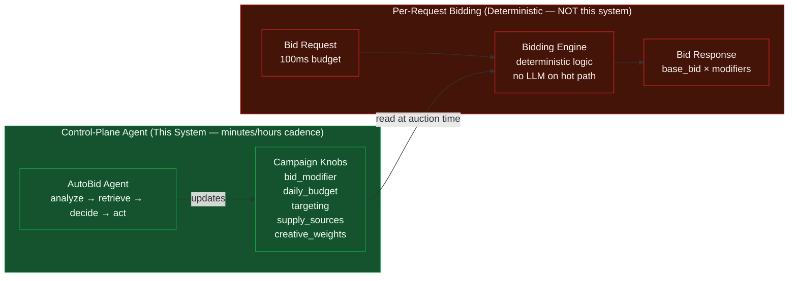
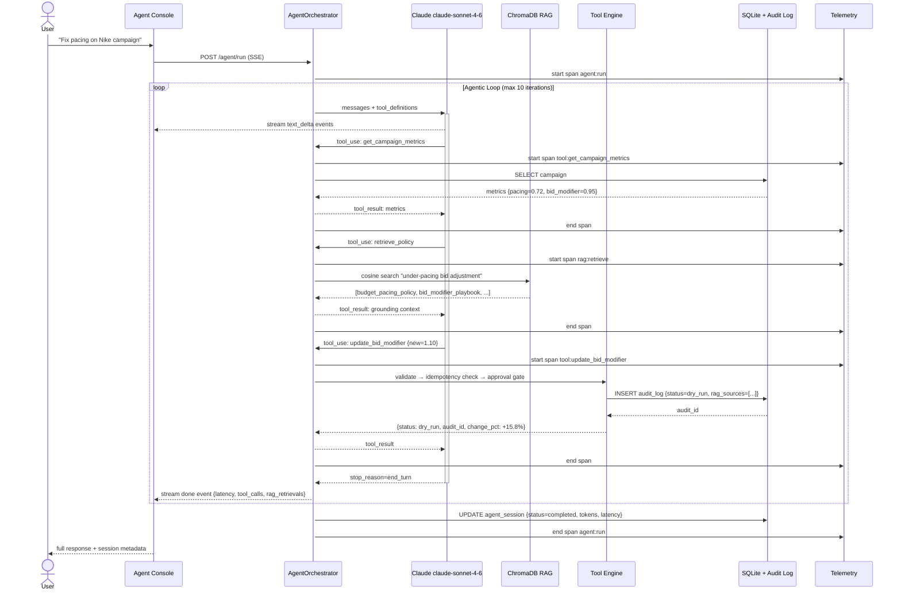

# AutoBid — Architecture Diagram

```mermaid
graph TB
    subgraph Browser["🌐 Browser"]
        direction TB
        UI_DASH["Dashboard\n(campaigns, alerts,\nexperiments, audit feed)"]
        UI_AGENT["Agent Console\n(SSE streaming chat,\ntool call inspector,\ndry-run toggle)"]
        UI_AUDIT["Audit Log\n(approve / reject /\nrollback actions)"]
        UI_EXP["Experiments\n(A/B results,\nlift %, p-value)"]
        UI_TRACE["Traces\n(waterfall, span\nlatency breakdown)"]
        UI_CAMP["Campaign Detail\n(24h chart, targeting,\nsupply sources)"]
    end

    subgraph Frontend["⚡ Frontend — Next.js 14 (App Router, TypeScript, Tailwind)"]
        direction TB
        RSC["React Server Components\n(SSR — fetches data at request time)"]
        CLIENT["Client Components\n('use client' — AgentConsole,\nAuditLogView, CampaignChart)"]
        SSE_CLIENT["SSE Stream Reader\nstreamAgentRun()\nasync generator"]
        API_CLIENT["api.ts\nTyped fetch wrappers"]
    end

    subgraph BackendAPI["🔌 Backend API — FastAPI (Python 3.11)"]
        direction LR
        RT_CAMP["/campaigns\nGET list, metrics,\n24h history"]
        RT_AGENT["/agent/run  POST\n/agent/sessions  GET\nSSE streaming response"]
        RT_AUDIT["/audit  GET\n/audit/:id/approve\n/reject  /rollback"]
        RT_EXP["/experiments  GET"]
        RT_TRACE["/traces  GET\n/traces/:id  GET"]
    end

    subgraph AgentLayer["🤖 Agent Layer"]
        direction TB
        ORCH["AgentOrchestrator\nrun() → AsyncGenerator\nstreams events to SSE"]
        LOOP["Agentic Loop\nmax 10 iterations\nstop_reason=end_turn"]
        CLAUDE["Claude claude-sonnet-4-6\n8 tool definitions\nstreaming tool use"]
        ORCH --> LOOP --> CLAUDE
    end

    subgraph RAGLayer["📚 RAG Layer — ChromaDB (all-MiniLM-L6-v2)"]
        direction LR
        RETRIEVER["retrieve()\nmulti-collection\ncosine similarity"]
        subgraph Collections["Vector Collections"]
            COL_POL["policies_playbooks\n(budget_pacing,\nbid_modifier,\ntargeting,\nsupply_quality,\napproval_policy)"]
            COL_HIST["campaign_history\n(episodic memory:\nbid changes, targeting\nupdates, summaries)"]
            COL_TEL["telemetry_aggregates\n(performance summaries\nindexed at agent runtime)"]
        end
        FORMAT["format_context_for_prompt()\nranked, deduplicated\nsource-attributed context"]
        RETRIEVER --> Collections
        Collections --> FORMAT
    end

    subgraph ToolEngine["🔧 Tool Engine — Safe Action Interface"]
        direction TB
        T1["get_campaign_metrics\n🔍 read-only"]
        T2["retrieve_policy\n🔍 RAG search"]
        T3["update_bid_modifier\n⚡ 0.50x–2.00x clamp\n>50% → approval"]
        T4["update_budget\n💰 >25% → approval"]
        T5["pause_campaign\n⏸ always approval"]
        T6["update_targeting\n🎯 auto-approved"]
        T7["update_supply_sources\n🏗 auto-approved"]
        T8["route_creative\n🎨 auto-approved"]

        SAFETY["Safety Layer\n• idempotency_key = SHA256\n• dry_run → no DB writes\n• requires_approval gate\n• rollback_params snapshot\n• clamped value ranges"]
    end

    subgraph DataLayer["🗄 Data Layer — SQLite (aiosqlite + SQLAlchemy async)"]
        direction LR
        DB_CAMP["campaigns\n+ campaign_snapshots\n(24h hourly history)"]
        DB_AUDIT["audit_logs\n(immutable action record:\nbefore/after state,\nRAG sources, rationale,\nidempotency key,\nrollback params)"]
        DB_SESS["agent_sessions\n(token accounting,\ntool call count,\nRAG retrievals,\nfull message log)"]
        DB_EXP["experiments\n(A/B metadata,\nlift %, p-value,\nsignificance flag)"]
    end

    subgraph Telemetry["📡 Telemetry — In-Process Distributed Tracing"]
        direction LR
        TRACER_A["agent_tracer\nspans: agent:run,\nagent:iteration:N"]
        TRACER_R["rag_tracer\nspans: rag:retrieve"]
        TRACER_T["tool_tracer\nspans: tool:{name}"]
        SPAN_STORE["In-memory span store\ntrace_id → []Span\nexported via /traces API\n(prod: OTLP → Jaeger/Tempo)"]
        TRACER_A & TRACER_R & TRACER_T --> SPAN_STORE
    end

    subgraph External["☁️ External"]
        ANTHROPIC["Anthropic API\nclaude-sonnet-4-6\nstreaming Messages API"]
    end

    %% Browser → Frontend wiring
    Browser -.-> Frontend

    %% Frontend → Backend wiring
    RSC -->|"fetch() server-side"| BackendAPI
    SSE_CLIENT -->|"POST /agent/run\ntext/event-stream"| RT_AGENT
    API_CLIENT -->|"REST"| BackendAPI

    %% Backend → Agent
    RT_AGENT -->|"AsyncGenerator\nevents"| ORCH

    %% Agent → Claude
    CLAUDE <-->|"anthropic.AsyncAnthropic\nstream()"| ANTHROPIC

    %% Agent → RAG
    CLAUDE -->|"retrieve_policy tool"| RETRIEVER
    FORMAT -->|"grounding context\ninjected into messages"| CLAUDE

    %% Agent → Tools
    CLAUDE -->|"tool_use blocks"| ToolEngine
    SAFETY -->|"write"| DataLayer

    %% Telemetry wiring
    AgentLayer --> Telemetry
    RAGLayer --> Telemetry
    ToolEngine --> Telemetry
    Telemetry -->|"/traces"| RT_TRACE

    %% Data reads
    T1 -->|"SELECT"| DB_CAMP
    BackendAPI -->|"SELECT"| DataLayer

    %% Styling
    classDef frontend fill:#1e1b4b,stroke:#6d28d9,color:#e2e8f0
    classDef agent fill:#14532d,stroke:#16a34a,color:#e2e8f0
    classDef rag fill:#1e3a5f,stroke:#3b82f6,color:#e2e8f0
    classDef tools fill:#431407,stroke:#ea580c,color:#e2e8f0
    classDef data fill:#1c1917,stroke:#78716c,color:#e2e8f0
    classDef telemetry fill:#2d1b69,stroke:#7c3aed,color:#e2e8f0
    classDef external fill:#0c1a2e,stroke:#0ea5e9,color:#e2e8f0
    classDef browser fill:#0f172a,stroke:#475569,color:#e2e8f0

    class Frontend,RSC,CLIENT,SSE_CLIENT,API_CLIENT,UI_DASH,UI_AGENT,UI_AUDIT,UI_EXP,UI_TRACE,UI_CAMP frontend
    class AgentLayer,ORCH,LOOP,CLAUDE agent
    class RAGLayer,RETRIEVER,COL_POL,COL_HIST,COL_TEL,FORMAT,Collections rag
    class ToolEngine,T1,T2,T3,T4,T5,T6,T7,T8,SAFETY tools
    class DataLayer,DB_CAMP,DB_AUDIT,DB_SESS,DB_EXP data
    class Telemetry,TRACER_A,TRACER_R,TRACER_T,SPAN_STORE telemetry
    class External,ANTHROPIC external
    class Browser browser
```

---

## Control-Plane Boundary

```mermaid
graph LR
    subgraph PerRequest["Per-Request Bidding (Deterministic — NOT this system)"]
        direction LR
        BID_REQ["Bid Request\n100ms budget"]
        BID_ENGINE["Bidding Engine\ndeterministic logic\nno LLM on hot path"]
        BID_RESP["Bid Response\nbase_bid × modifiers"]
        BID_REQ --> BID_ENGINE --> BID_RESP
    end

    subgraph ControlPlane["Control-Plane Agent (This System — minutes/hours cadence)"]
        direction LR
        AGENT_LOOP["AutoBid Agent\nanalyze → retrieve → decide → act"]
        KNOBS["Campaign Knobs\nbid_modifier\ndaily_budget\ntargeting\nsupply_sources\ncreative_weights"]
        AGENT_LOOP -->|"updates"| KNOBS
    end

    KNOBS -->|"read at auction time"| BID_ENGINE

    classDef hot fill:#431407,stroke:#dc2626,color:#fef2f2
    classDef cold fill:#14532d,stroke:#16a34a,color:#f0fdf4
    class PerRequest,BID_REQ,BID_ENGINE,BID_RESP hot
    class ControlPlane,AGENT_LOOP,KNOBS cold
```

---

## Agent Decision Loop

```mermaid
sequenceDiagram
    actor User
    participant Console as Agent Console
    participant Agent as AgentOrchestrator
    participant Claude as Claude claude-sonnet-4-6
    participant RAG as ChromaDB RAG
    participant Tools as Tool Engine
    participant DB as SQLite + Audit Log
    participant Tracer as Telemetry

    User->>Console: "Fix pacing on Nike campaign"
    Console->>+Agent: POST /agent/run (SSE)
    Agent->>Tracer: start span agent:run

    loop Agentic Loop (max 10 iterations)
        Agent->>+Claude: messages + tool_definitions
        Claude-->>Console: stream text_delta events
        Claude->>Agent: tool_use: get_campaign_metrics
        Agent->>Tracer: start span tool:get_campaign_metrics
        Agent->>DB: SELECT campaign
        DB-->>Agent: metrics {pacing=0.72, bid_modifier=0.95}
        Agent-->>Claude: tool_result: metrics
        Agent->>Tracer: end span

        Claude->>Agent: tool_use: retrieve_policy
        Agent->>Tracer: start span rag:retrieve
        Agent->>RAG: cosine search "under-pacing bid adjustment"
        RAG-->>Agent: [budget_pacing_policy, bid_modifier_playbook, ...]
        Agent-->>Claude: tool_result: grounding context
        Agent->>Tracer: end span

        Claude->>Agent: tool_use: update_bid_modifier {new=1.10}
        Agent->>Tracer: start span tool:update_bid_modifier
        Agent->>Tools: validate → idempotency check → approval gate
        Tools->>DB: INSERT audit_log {status=dry_run, rag_sources=[...]}
        DB-->>Tools: audit_id
        Tools-->>Agent: {status: dry_run, audit_id, change_pct: +15.8%}
        Agent-->>Claude: tool_result
        Agent->>Tracer: end span

        Claude-->>-Agent: stop_reason=end_turn
        Agent-->>Console: stream done event {latency, tool_calls, rag_retrievals}
    end

    Agent->>DB: UPDATE agent_session {status=completed, tokens, latency}
    Agent->>Tracer: end span agent:run
    Console-->>User: full response + session metadata
```
